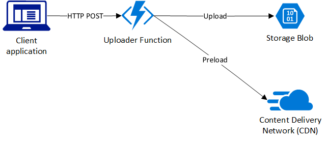

[](https://dev.azure.com/microsoftyev/static-content-uploader/_build/latest?definitionId=32&branchName=master)

# Uploading and CDN-preloading static content with Azure Functions

## Overview
This sample demonstrates how Azure services can be used to upload static content and make it immediately available for fast downloads all over the world.

## Using Azure For Content Uploads
This sample shows how to use Azure Functions to create a restful backend API for uploading content to Azure storage via a standard HTML form. After a completed upload, the new file is [preloaded to Azure CDN](https://docs.microsoft.com/azure/cdn/cdn-preload-endpoint) for immediate local availability.




## Building and setup
The steps below require Java 8 or later, Maven 3.3 or later, and either Azure CLI or PowerShell with the `Az` module. [Azure CloudShell](https://docs.microsoft.com/azure/cloud-shell) can be used if these dependencies are not available locally.

1. Copy the file `deployment.properties.template` to `deployment.properties` and fill in the values. For example:
```
location=eastus

functionAppResourceGroup=contentUpload
functionAppName=contentuploader

cdnSubscriptionId=00000000-0000-0000-0000-000000000000
cdnResourceGroup=contentUpload
cdnProfileName=uploadcdnprofile
cdnEndpointName=uploadendpoint

storageSubscriptionId=00000000-0000-0000-0000-000000000000
storageResourceGroup=contentUpload
storageAccountName=uploadstorageaccount
storageContainerName=uploads
```

2. Run `mvn package azure-functions:deploy`. This will create the resource group specified by `functionAppResourceGroup` in step 1, and upload the Azure Functions application. It will also popul

3. Provision the storage account for content and the CDN infrastructure by running one of the following:
 * `setup.ps1` in PowerShell. This requires the `Az` PowerShell module, which can be install by running `Install-Module Az`. You must be logged into your azure account (via [`Connect-AzAccount`](https://docs.microsoft.com/powershell/module/az.accounts/Connect-AzAccount)) prior to running.
 * `setup.sh` in a *nix shell. This requires [Azure CLI](https://docs.microsoft.com/cli/azure/install-azure-cli) to be installed. You must be logged into your azure account (via [`az login`](https://docs.microsoft.com/cli/azure/authenticate-azure-cli)) prior to running.


At the end of the script, a webpage will be generated (`upload.html`) through which you can test the file upload.

Note: when an Azure Endpoint is first provisioned using Verizon as the CDN provider, it may take about 90 minutes for the registration to complete.

## Using the solution

Open `upload.html`, which will be generated by the setup script. This is a standard HTML form that, when submitted, will make a POST request containing the file content to the Azure Function.

Use the Network Inspector in your browser's web tools to observe that the function returns HTTP status code 200, indicating success.

Once the upload completes, you should see your file become available at the CDN endpoint. Its URL will be `https://<endpoint name>.azureedge.net/<storage container name>/<file name>`. If, when attempting to access that URL, you get a 404/Resource Not Found error, [it likely means that the CDN registration has not been completed](). 

## How it works

### Accepting the upload
To accept a POST request with binary content, we a create a [POJO](https://en.wikipedia.org/wiki/Plain_old_Java_object) with a public method annotated as follows:

```java
@FunctionName("uploadFile")
public HttpResponseMessage run(@HttpTrigger(name = "requestTrigger",  methods = {
    HttpMethod.POST }, authLevel = AuthorizationLevel.ANONYMOUS) HttpRequestMessage<Optional<byte[]>> request,
    final ExecutionContext context) {
        ...
    }
```

This creates an HTTP endpoint that accepts a POST request at the URL `https://<functionAppName>.azurewebsites.net/api/uploadFile`. Note: `uploadFile` is the annotated `FunctionName`.

### Using the Azure SDK from an Azure Function
We use the Azure SDK to perform the core workloud of the function: writing file contents to Azure Blob Storage, and preloading the newly written files to Azure CDN.

#### Credentials and Permissions
We use [Azure Managed Identity](https://docs.microsoft.com/azure/active-directory/managed-identities-azure-resources/overview) to enable Azure Functions to inject credentials to access Azure. To use Azure Managed Identity, we first enable it from the setup scripts:

*PowerShell:*
```powershell
Set-AzWebApp -AssignIdentity $true -Name $config.functionAppName -ResourceGroupName $config.functionAppResourceGroup
```
*Azure CLI:*
```bash
az webapp identity assign --name "$functionAppName" --resource-group "$functionAppResourceGroup"
```

This creates a [Service Principal](https://docs.microsoft.com/azure/active-directory/develop/app-objects-and-service-principals#service-principal-object) for the Functions application. In order to authorize the functions application to write to Azure Blob Storage and preload to Azure CDN, we assign this service principal a `Contributor` role on these resources:

*PowerShell:*
```powershell
$appServicePrincipal = Get-AzADServicePrincipal -DisplayName $config.functionAppName
New-AzRoleAssignment -Scope $storageAccount.Id -RoleDefinitionName Contributor -ApplicationId $appServicePrincipal.ApplicationId
New-AzRoleAssignment -Scope $cdnProfile.Id -RoleDefinitionName Contributor -ApplicationId $appServicePrincipal.ApplicationId
```

*Azure CLI:*
```bash
functionSpAppId=$(az ad sp list --display-name "$functionAppName" --query '[].appId' -otsv)
az role assignment create --scope "$storageAccountId" --assignee "$functionSpAppId" --role Contributor
az role assignment create --scope "$cdnProfileId" --assignee "$functionSpAppId" --role Contributor
```


With the requisite roles now granted to our Function Application's service principal, we can now create an authenticated Azure SDK client within our function's code:

```java
Azure azure = Azure.authenticate(new AppServiceMSICredentials(AzureEnvironment.AZURE))
        .withSubscription(cdnSubscriptionId);
```

#### Configuration
We use [App Settings](https://docs.microsoft.com/azure/azure-functions/functions-how-to-use-azure-function-app-settings#settings) of Azure Functions to inject identifying information of outside resources, such as the CDN profile and the Blob Storage container.

Because we use the Azure Functions Maven plugin to deploy the application, we use the same plugin to publish App Settings:
```xml
<plugin>
    <groupId>com.microsoft.azure</groupId>
    <artifactId>azure-functions-maven-plugin</artifactId>
    <configuration>
        <resourceGroup>${functionAppResourceGroup}</resourceGroup>
        <appName>${functionAppName}</appName>
        <region>${location}</region>
        <appSettings>
            ...
            <property>
                <name>STORAGE_SUBSCRIPTION_ID</name>
                <value>${storageSubscriptionId}</value>
            </property>
            <property>
                <name>STORAGE_RESOURCE_GROUP</name>
                <value>${storageResourceGroup}</value>
            </property>
            <property>
                <name>STORAGE_ACCOUNT_NAME</name>
                <value>${storageAccountName}</value>
            </property>
            <property>
                <name>STORAGE_CONTAINER_NAME</name>
                <value>${storageContainerName}</value>
            </property>
            <property>
                <name>CDN_SUBSCRIPTION_ID</name>
                <value>${cdnSubscriptionId}</value>
            </property>
            <property>
                <name>CDN_RESOURCE_GROUP</name>
                <value>${cdnResourceGroup}</value>
            </property>
            <property>
                <name>CDN_PROFILE_NAME</name>
                <value>${cdnProfileName}</value>
            </property>
            <property>
                <name>CDN_ENDPOINT_NAME</name>
                <value>${cdnEndpointName}</value>
            </property>
        </appSettings>
    </configuration>
    <executions>
        <execution>
            <id>package-functions</id>
            <goals>
                <goal>package</goal>
            </goals>
        </execution>
    </executions>
</plugin>
```

From inside the Azure function code, the values of App Settings can be read as environment variables:
```java
String storageAccountSubscriptionId = System.getenv("STORAGE_SUBSCRIPTION_ID");
String storageAccountName = System.getenv("STORAGE_ACCOUNT_NAME");
String storageContainerName = System.getenv("STORAGE_CONTAINER_NAME");
String storageResourceGroup = System.getenv("STORAGE_RESOURCE_GROUP");
```

## Resources

* [Create your first function with Java and Maven](https://docs.microsoft.com/azure/azure-functions/functions-create-first-java-maven)
* [Azure Functions Java developer guide](https://docs.microsoft.com/azure/azure-functions/functions-reference-java)
* [Azure Storage](https://docs.microsoft.com/azure/storage/)
* [Azure CDN](https://docs.microsoft.com/azure/cdn/)
* [Azure for Java cloud developers](https://docs.microsoft.com/azure/java/)
* [Build and Deploy Java to Azure Functions using Azure Pipelines](https://docs.microsoft.com/en-us/azure/devops/pipelines/languages/java-function)
